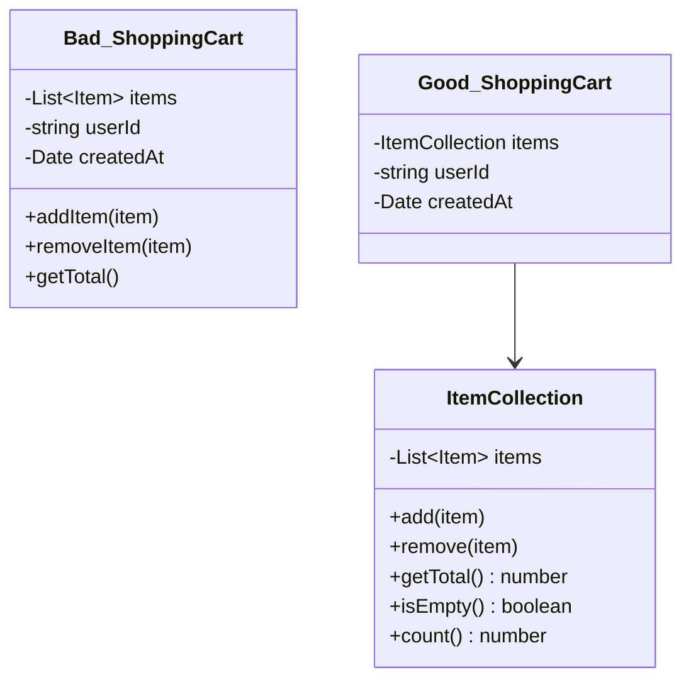

# Rule 4: First Class Collections

## Overview

Any class that contains a collection should contain nothing else. If you have a collection in a class, wrap it in its own class with methods that operate on that collection.

## The Problem

When collections are mixed with other instance variables:

- Collection manipulation logic gets scattered
- Difficult to add collection-specific behaviors
- Hard to ensure collection invariants
- Violates Single Responsibility Principle

## The Rule

**A class with a collection should contain only that collection and methods that operate on it.**

No other instance variables allowed. This forces you to:

- Create specific collection classes with domain-specific names
- Add behavior that operates on the collection
- Ensure collection rules and invariants

## Benefits

- **Encapsulated Behavior**: Collection operations in one place
- **Domain-Specific Names**: `OrderHistory` is clearer than `List<Order>`
- **Type Safety**: Can't mix up different collections
- **Invariant Protection**: Collection rules enforced in one place
- **Easier Testing**: Collection logic isolated

## Visual Example



## Example

### Bad Example (Collection + Other Data)

```typescript
class ShoppingCart {
  private items: Item[] = [];
  private userId: string;
  private createdAt: Date;

  addItem(item: Item) {
    this.items.push(item);
  }

  getTotal(): number {
    return this.items.reduce((sum, item) => sum + item.price, 0);
  }

  getItemCount(): number {
    return this.items.length;
  }
}
```

### Good Example (First Class Collection)

```typescript
class ItemCollection {
  private readonly items: Item[] = [];

  add(item: Item): void {
    this.items.push(item);
  }

  remove(itemId: string): void {
    const index = this.items.findIndex((i) => i.id === itemId);
    if (index >= 0) {
      this.items.splice(index, 1);
    }
  }

  getTotal(): number {
    return this.items.reduce((sum, item) => sum + item.price, 0);
  }

  count(): number {
    return this.items.length;
  }

  isEmpty(): boolean {
    return this.items.length === 0;
  }

  hasItem(itemId: string): boolean {
    return this.items.some((i) => i.id === itemId);
  }
}

class ShoppingCart {
  private readonly items: ItemCollection;
  private readonly userId: string;
  private readonly createdAt: Date;

  constructor(userId: string) {
    this.items = new ItemCollection();
    this.userId = userId;
    this.createdAt = new Date();
  }

  addItem(item: Item): void {
    this.items.add(item);
  }

  getTotal(): number {
    return this.items.getTotal();
  }
}
```

## Key Takeaways

- One collection per class, no other instance variables
- Give collections domain-specific names
- Add collection-specific behavior (filter, find, validate)
- Protect collection invariants in one place
- Makes collection operations reusable
