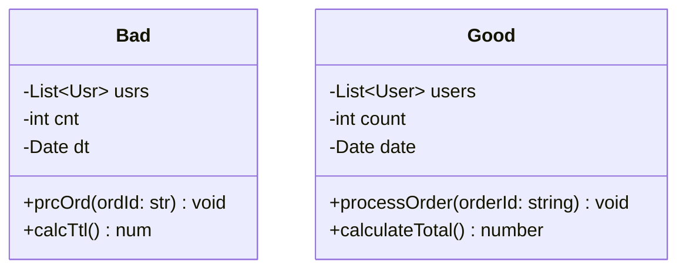

# Rule 6: Don't Abbreviate

## Overview

Abbreviations save a few keystrokes but cost clarity. Full, descriptive names make code self-documenting and easier to understand.

## The Problem

Abbreviated names:

- Require mental translation (what does `usrMgr` mean?)
- Can be ambiguous (`msg` = message or messages?)
- Make code harder to search
- Reduce IDE autocomplete effectiveness
- Don't save time in the long run

## The Rule

**Never use abbreviations. Write out full words.**

Apply this to:

- Variable names
- Method names
- Class names
- Parameter names
- Property names

## Benefits

- **Self-Documenting**: Code explains itself without comments
- **No Ambiguity**: Clear what each identifier represents
- **Better Searchability**: Easy to find usage across codebase
- **Improved IDE Support**: Autocomplete works better with full words
- **Easier Onboarding**: New team members understand immediately

## Visual Example



## Example

### Bad Example (Abbreviations)

```typescript
class UsrMgr {
  private usrs: Usr[] = [];

  addUsr(usr: Usr): void {
    this.usrs.push(usr);
  }

  getUsrById(id: str): Usr | undef {
    return this.usrs.find((u) => u.id === id);
  }

  calcTtlAmt(ordId: str): num {
    const ord = this.getOrdById(ordId);
    return ord.itms.reduce((sum, itm) => sum + itm.prc, 0);
  }
}
```

### Good Example (No Abbreviations)

```typescript
class UserManager {
  private users: User[] = [];

  addUser(user: User): void {
    this.users.push(user);
  }

  getUserById(id: string): User | undefined {
    return this.users.find((user) => user.id === id);
  }

  calculateTotalAmount(orderId: string): number {
    const order = this.getOrderById(orderId);
    return order.items.reduce((sum, item) => sum + item.price, 0);
  }
}
```

## Common Abbreviations to Avoid

| Bad    | Good            |
| ------ | --------------- |
| `usr`  | `user`          |
| `mgr`  | `manager`       |
| `btn`  | `button`        |
| `msg`  | `message`       |
| `ctx`  | `context`       |
| `cfg`  | `configuration` |
| `tmp`  | `temporary`     |
| `cnt`  | `count`         |
| `idx`  | `index`         |
| `arr`  | `array`         |
| `str`  | `string`        |
| `num`  | `number`        |
| `calc` | `calculate`     |
| `proc` | `process`       |

## Exceptions

- Well-established industry terms (`HTML`, `URL`, `API`)
- Mathematical formulas (`x`, `y` in coordinate systems)
- Loop counters in small scopes (debatable, prefer `index`)

## Key Takeaways

- Clarity over brevity always
- Modern IDEs have autocomplete - typing isn't the bottleneck
- Code is read far more than written
- Full words make intent obvious
- If you need to explain an abbreviation, don't use it
