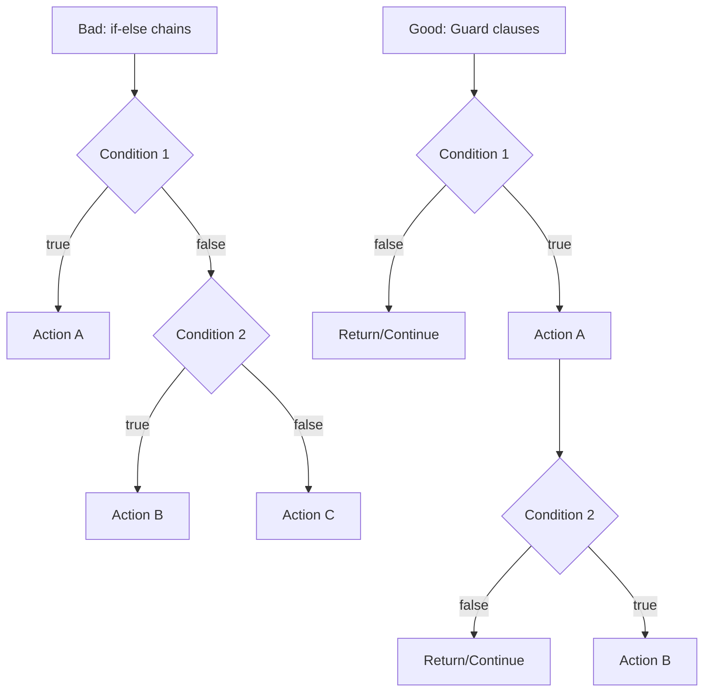

# Rule 2: Don't Use the ELSE Keyword

## Overview

Eliminating `else` statements forces you to think about early returns, guard clauses, and polymorphism. This leads to more readable code with less cognitive load.

## The Problem

`else` statements increase complexity and force readers to keep multiple execution paths in their head simultaneously. They often indicate that a method is doing too much or mixing different levels of abstraction.

## The Rule

**Never use the `else` keyword.**

Replace `else` with:

- Early returns (guard clauses)
- Polymorphism (Strategy pattern, State pattern)
- Ternary operators for simple value assignments
- Null Object pattern

## Benefits

- **Reduced Cognitive Load**: Reader only needs to track one execution path at a time
- **Improved Readability**: Code flows linearly with clear exit points
- **Better Design**: Encourages polymorphism and better object-oriented design
- **Easier Testing**: Fewer branching paths mean simpler test cases

## Visual Example



## Example

### Bad Example (Using ELSE)

```typescript
function calculateDiscount(customer: Customer, amount: number): number {
  if (customer.isPremium) {
    if (amount > 100) {
      return amount * 0.2;
    } else {
      return amount * 0.1;
    }
  } else {
    if (amount > 100) {
      return amount * 0.05;
    } else {
      return 0;
    }
  }
}
```

### Good Example (No ELSE - Guard Clauses)

```typescript
function calculateDiscount(customer: Customer, amount: number): number {
  if (!customer.isPremium && amount <= 100) return 0;
  if (!customer.isPremium) return amount * 0.05;
  if (amount > 100) return amount * 0.2;
  return amount * 0.1;
}
```

### Good Example (No ELSE - Polymorphism)

```typescript
interface CustomerType {
  calculateDiscount(amount: number): number;
}

class PremiumCustomer implements CustomerType {
  calculateDiscount(amount: number): number {
    if (amount > 100) return amount * 0.2;
    return amount * 0.1;
  }
}

class RegularCustomer implements CustomerType {
  calculateDiscount(amount: number): number {
    if (amount > 100) return amount * 0.05;
    return 0;
  }
}
```

## Key Takeaways

- Use guard clauses to handle special cases first
- Return early to avoid nesting
- Use polymorphism for complex conditional logic
- Each return statement represents a clear outcome
- Code becomes a series of "if this, then done" statements
