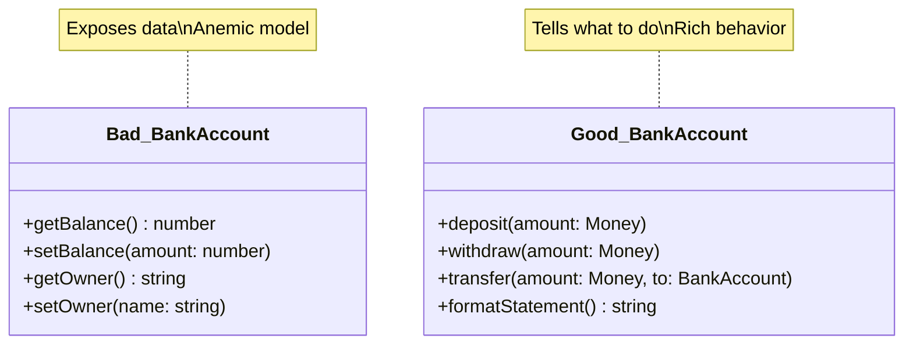

# Rule 9: No Getters/Setters/Properties

## Overview

The most controversial rule. It encourages "Tell, Don't Ask" - objects should do work, not expose their data for others to manipulate.

## The Problem

Getters and setters:

- Break encapsulation by exposing internal state
- Lead to anemic domain models (data bags with no behavior)
- Encourage procedural code disguised as OOP
- Create tight coupling to internal representation
- Make it hard to maintain invariants

## The Rule

**Don't expose internal state through getters/setters. Instead, tell objects what to do.**

Replace:

- `customer.getWallet().setBalance(100)`
- With: `customer.creditAccount(100)`

## Benefits

- **True Encapsulation**: Internal state stays internal
- **Rich Domain Models**: Behavior lives with the data
- **Easier Refactoring**: Can change internal representation freely
- **Clear Intent**: Methods express business operations
- **Protected Invariants**: Objects maintain their own consistency

## Visual Example



## Example

### Bad Example (Getters/Setters - Ask)

```typescript
class BankAccount {
  private balance: number = 0;

  getBalance(): number {
    return this.balance;
  }

  setBalance(amount: number): void {
    this.balance = amount;
  }
}

// Client code "asks" for data and manipulates it
const account = new BankAccount();
const balance = account.getBalance(); // Ask
account.setBalance(balance + 100); // Manipulate externally
```

### Good Example (Tell, Don't Ask)

```typescript
class BankAccount {
  private balance: number = 0;

  deposit(amount: number): void {
    if (amount <= 0) {
      throw new Error("Amount must be positive");
    }
    this.balance += amount;
  }

  withdraw(amount: number): void {
    if (amount > this.balance) {
      throw new Error("Insufficient funds");
    }
    this.balance -= amount;
  }

  transfer(amount: number, to: BankAccount): void {
    this.withdraw(amount);
    to.deposit(amount);
  }
}

// Client code "tells" what to do
const account = new BankAccount();
account.deposit(100); // Tell what to do
```

## Exceptions

Reasonable exceptions exist:

- **DTOs/Value Objects**: Pure data transfer (API responses, config)
- **Display Logic**: Formatting data for UI (but use dedicated formatting methods)
- **Query Objects**: Read-only views of data
- **Builder Pattern**: Construction-time configuration

Even with exceptions, prefer behavior over bare data exposure.

## Key Takeaways

- Tell objects what to do, don't ask for their data
- Push behavior into the objects that own the data
- Use intention-revealing methods (`deposit()` vs `setBalance()`)
- Protect invariants by keeping state private
- Create rich domain models, not anemic data bags
- This is a guideline, not an absolute law - use judgment
