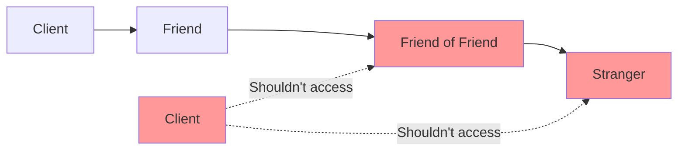

# Rule 5: One Dot Per Line (Law of Demeter)

## Overview

Also known as the **Law of Demeter** or the principle of least knowledge. This rule states that you should only talk to your immediate friends, not to strangers.

## The Problem

Chaining multiple method calls (like `object.getA().getB().getC()`) creates tight coupling and violates encapsulation. Changes deep in the chain break all callers.

## The Rule

**Use only one dot (method call) per line.**

A method should only call methods on:

- Itself (`this`)
- Objects passed as parameters
- Objects it creates
- Direct instance variables

## Benefits

- **Reduced Coupling**: Changes don't ripple through the system
- **Better Encapsulation**: Objects hide their internal structure
- **Easier Refactoring**: Can change internals without breaking callers
- **Clearer Dependencies**: Explicit about what objects need
- **Testability**: Easier to mock direct dependencies

## Visual Example



## Example

### Bad Example (Multiple Dots)

```typescript
class Order {
  processPayment() {
    // Too many dots - reaching through multiple objects
    const amount = this.customer.getWallet().getBalance().getAmount();
    const street = this.customer.getAddress().getStreet();

    // Tightly coupled to internal structure
    this.customer.getWallet().getBalance().deduct(amount);
  }
}
```

### Good Example (One Dot - Tell, Don't Ask)

```typescript
class Order {
  processPayment() {
    // Tell the customer to pay, don't reach into its internals
    this.customer.pay(this.amount);

    // Ask customer for address, not address internals
    const address = this.customer.getShippingAddress();
  }
}

class Customer {
  pay(amount: number): void {
    // Customer knows how to handle payment internally
    this.wallet.deduct(amount);
  }

  getShippingAddress(): string {
    // Customer decides how to format the address
    return this.address.formatForShipping();
  }
}
```

## Exceptions

Fluent interfaces and builder patterns are acceptable:

```typescript
// OK - Fluent API returns same object
query.select("*").from("users").where("age > 18").orderBy("name");
```

## Key Takeaways

- Tell objects what to do, don't ask for their internal state
- Each object should only talk to its direct collaborators
- Use "Tell, Don't Ask" principle
- Fluent interfaces (method chaining) are an exception
- Reduces coupling and improves encapsulation
