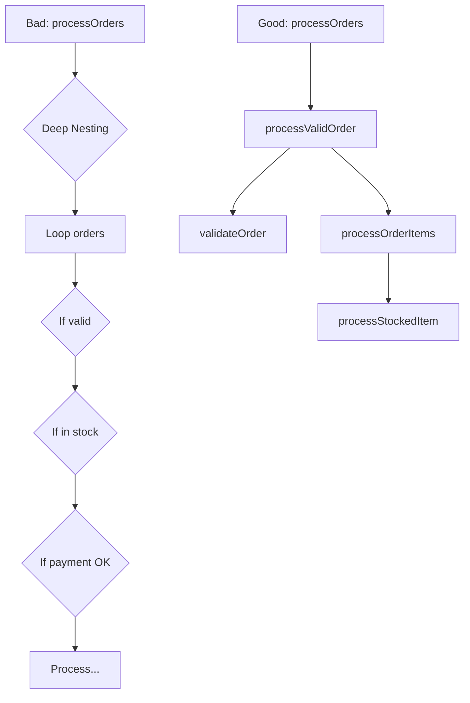

# Rule 1: Only One Level of Indentation Per Method

## Overview

This rule forces you to extract complex logic into smaller, well-named methods. It improves readability and makes your code easier to test and maintain.

## The Problem

Deep nesting makes code hard to read and understand. Each level of indentation represents a new level of abstraction, and mixing multiple levels of abstraction in one method violates the Single Responsibility Principle.

## The Rule

**Each method should have at most one level of indentation.**

If you need another level, extract it into a separate method with a descriptive name.

## Benefits

- **Improved Readability**: Flat structure is easier to scan and understand
- **Better Testing**: Smaller methods are easier to unit test
- **Clear Abstraction**: Each method does one thing at one level of abstraction
- **Easier Debugging**: Problems are isolated to specific, small methods

## Visual Example



## Example

### Bad Example (Multiple Levels of Indentation)

```typescript
class OrderProcessor {
  processOrders(orders: any[]) {
    for (const order of orders) {
      // Level 1
      if (order.isValid) {
        // Level 2
        if (order.items.length > 0) {
          // Level 3
          for (const item of order.items) {
            // Level 4
            if (item.inStock) {
              // Level 5
              // Process item...
            }
          }
        }
      }
    }
  }
}
```

### Good Example (One Level of Indentation)

```typescript
class OrderProcessor {
  processOrders(orders: Order[]) {
    for (const order of orders) {
      // Level 1 only
      this.processValidOrder(order);
    }
  }

  private processValidOrder(order: Order) {
    if (!order.isValid) return; // Level 1 only
    this.processOrderItems(order.items);
  }

  private processOrderItems(items: OrderItem[]) {
    for (const item of items) {
      // Level 1 only
      this.processStockedItem(item);
    }
  }

  private processStockedItem(item: OrderItem) {
    if (!item.inStock) return; // Level 1 only
    // Process item...
  }
}
```

## Key Takeaways

- Use early returns to avoid nesting
- Extract nested loops into separate methods
- Give extracted methods meaningful names that describe what they do
- Each method should read like a paragraph at one level of abstraction
