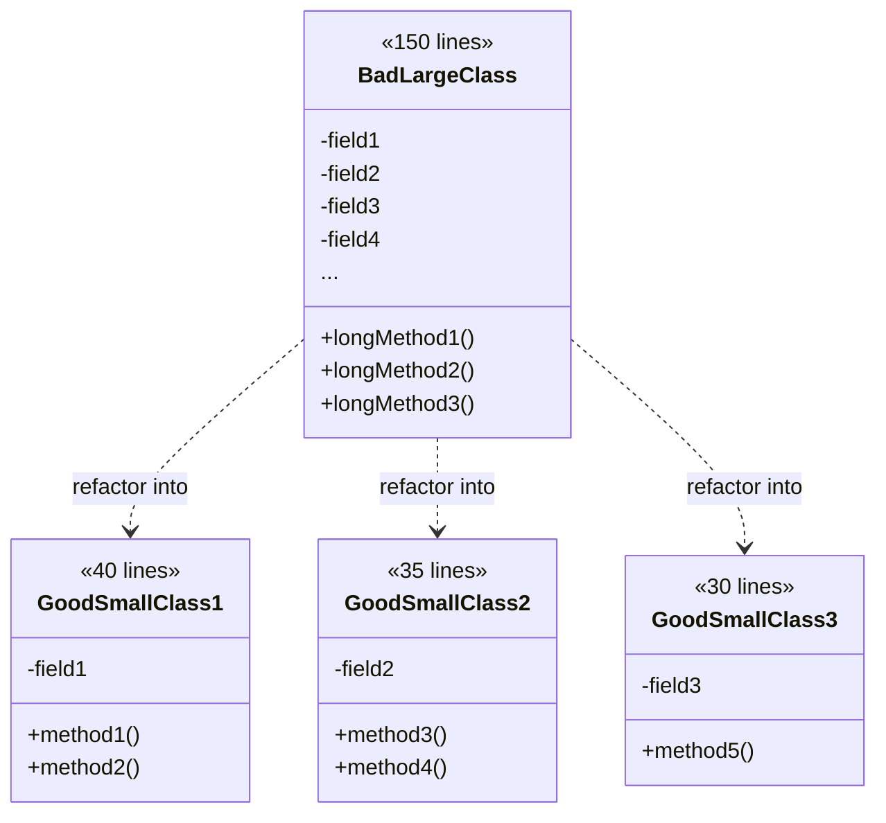

# Rule 7: Keep All Entities Small

## Overview

Small classes and methods are easier to understand, test, and maintain. This rule enforces strict limits on the size of your code entities.

## The Problem

Large classes and methods:

- Difficult to understand in one sitting
- Harder to test thoroughly
- More likely to violate Single Responsibility Principle
- Increase cognitive load
- Harder to reuse

## The Rule

**Keep all entities small:**

- **Classes**: No more than 50 lines
- **Methods**: No more than 10 lines (preferably 5)
- **Packages/Modules**: No more than 10 files

These limits force you to break down complex logic into smaller, focused units.

## Benefits

- **Improved Readability**: Fits on one screen
- **Easier Testing**: Small units are simple to test
- **Better Reusability**: Small, focused pieces can be reused
- **Clearer Purpose**: Small entities have obvious responsibilities
- **Faster Comprehension**: Less code to understand at once

## Visual Example



## Example

### Bad Example (Large Class)

```typescript
class UserService {
  // 30+ methods, 200+ lines
  createUser() {
    /* 30 lines */
  }
  validateUser() {
    /* 25 lines */
  }
  sendEmail() {
    /* 20 lines */
  }
  updateProfile() {
    /* 25 lines */
  }
  deleteUser() {
    /* 20 lines */
  }
  generateReport() {
    /* 40 lines */
  }
  // ... many more methods
}
```

### Good Example (Small Focused Classes)

```typescript
// Each class < 50 lines, each method < 10 lines

class UserCreator {
  create(data: UserData): User {
    const user = this.buildUser(data);
    this.validate(user);
    return user;
  }

  private buildUser(data: UserData): User {
    // < 5 lines
  }

  private validate(user: User): void {
    // < 5 lines
  }
}

class UserEmailService {
  send(user: User, template: EmailTemplate): void {
    const email = this.buildEmail(user, template);
    this.deliver(email);
  }

  private buildEmail(user: User, template: EmailTemplate): Email {
    // < 5 lines
  }

  private deliver(email: Email): void {
    // < 5 lines
  }
}

class UserReportGenerator {
  generate(users: User[]): Report {
    const data = this.collectData(users);
    return this.format(data);
  }

  private collectData(users: User[]): ReportData {
    // < 5 lines
  }

  private format(data: ReportData): Report {
    // < 5 lines
  }
}
```

## Guidelines

### For Methods:

- 5 lines is ideal
- 10 lines is maximum
- If longer, extract private methods
- One level of indentation (see Rule 1)

### For Classes:

- 50 lines total (including methods)
- If larger, split into multiple classes
- Each class should have one responsibility
- Use composition over large hierarchies

## Key Takeaways

- Small is relative, but limits force discipline
- Break large entities into smaller collaborating ones
- Each piece should be understandable in isolation
- Prefer many small classes over few large ones
- Quality over quantity - don't create pointless tiny classes
