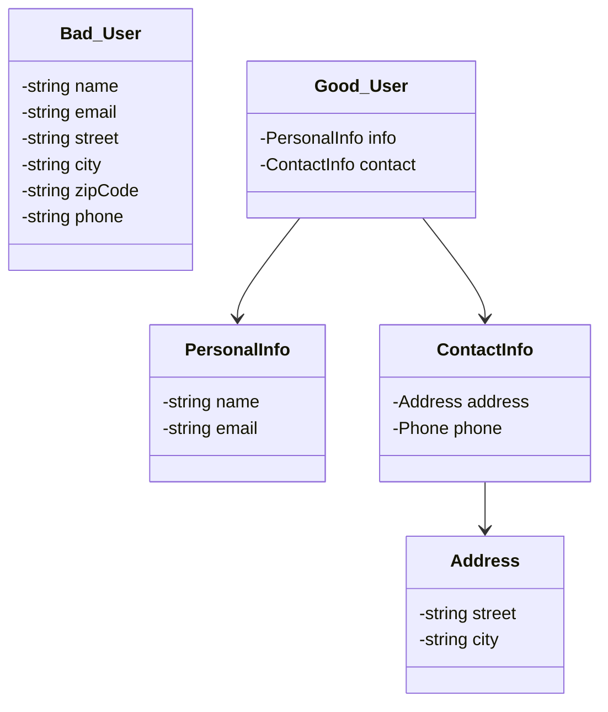

# Rule 8: No Classes With More Than Two Instance Variables

## Overview

This is the most controversial Object Calisthenics rule. Limiting instance variables to two forces high cohesion and decomposition into smaller, collaborating objects.

## The Problem

Classes with many instance variables often:

- Have low cohesion (variables used by different methods)
- Violate Single Responsibility Principle
- Are hard to understand and test
- Encourage feature envy and inappropriate intimacy

## The Rule

**No class should have more than two instance variables.**

This forces you to:

- Decompose complex objects into smaller collaborating objects
- Group related variables into value objects
- Create proper abstractions
- Use composition effectively

## Benefits

- **High Cohesion**: Variables are always used together
- **Better Decomposition**: Forces you to find proper abstractions
- **Clearer Responsibilities**: Each class does one thing with minimal data
- **Improved Testability**: Smaller, focused classes are easier to test
- **Explicit Dependencies**: Relationships become clear

## Visual Example



## Example

### Bad Example (Too Many Instance Variables)

```typescript
class User {
  private name: string;
  private email: string;
  private street: string;
  private city: string;
  private zipCode: string;
  private phone: string;
  private accountBalance: number;

  // Low cohesion - methods use different subsets of variables
}
```

### Good Example (Max Two Instance Variables)

```typescript
class User {
  private personalInfo: PersonalInfo;
  private contactInfo: ContactInfo;
  // Only 2 instance variables!
}

class PersonalInfo {
  private name: string;
  private email: string;
  // Only 2 instance variables!
}

class ContactInfo {
  private address: Address;
  private phone: Phone;
  // Only 2 instance variables!
}

class Address {
  private street: string;
  private city: string;
  // Only 2 instance variables!
}
```

## When to Relax This Rule

This is the most extreme calisthenics rule. Consider relaxing it to:

- 3-4 variables for data transfer objects (DTOs)
- Value objects with tightly related primitive fields
- Framework-imposed structures

The spirit of the rule is more important than the letter: keep cohesion high and classes focused.

## Key Takeaways

- Group related variables into value objects
- Use composition to manage complexity
- High cohesion: all variables should be used together
- This is a training exercise - the goal is better decomposition
- Don't dogmatically apply if it makes code worse
