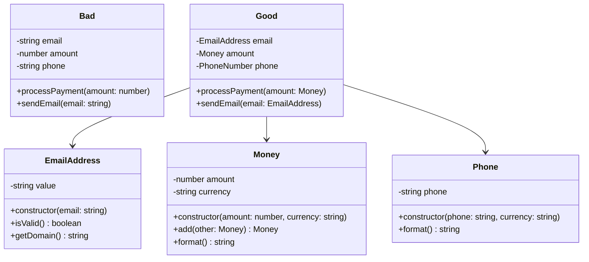

# Rule 3: Wrap All Primitives and Strings

## Overview

This rule enforces encapsulation by wrapping primitive values (numbers, strings, booleans) in small classes when they have business meaning. This adds type safety and prevents primitive obsession.

## The Problem

Using raw primitives throughout your code means:

- No type safety (a string email can be confused with a string name)
- Validation logic scattered everywhere
- Business rules spread across the codebase
- Difficult to change representation

## The Rule

**If a primitive has behavior or business meaning, wrap it in a class.**

This includes:

- Email addresses
- Phone numbers
- Currency amounts
- Dates with specific business rules
- Identifiers (user IDs, order IDs)
- Measurements (weight, distance)

## Benefits

- **Type Safety**: Compiler prevents mixing up similar primitives
- **Centralized Validation**: Rules live in one place
- **Explicit Business Logic**: Intent is clear from the type name
- **Easy to Extend**: Add behavior without changing callers
- **Self-Documenting**: `EmailAddress` is clearer than `string`

## Visual Example



## Example

### Bad Example (Primitive Obsession)

```typescript
class User {
  constructor(
    public email: string,
    public age: number,
    public salary: number
  ) {}
}

function sendEmail(email: string) {
  // Validation scattered
  if (!email.includes("@")) {
    throw new Error("Invalid email");
  }
  console.log(`Sending to ${email}`);
}

function giveRaise(salary: number, percentage: number): number {
  // Business logic scattered
  return salary * (1 + percentage / 100);
}
```

### Good Example (Wrapped Primitives)

```typescript
class EmailAddress {
  private constructor(private readonly value: string) {
    this.validate();
  }

  static create(email: string): EmailAddress {
    return new EmailAddress(email);
  }

  private validate(): void {
    if (!this.value.includes("@")) {
      throw new Error("Invalid email");
    }
  }

  getDomain(): string {
    return this.value.split("@")[1];
  }

  toString(): string {
    return this.value;
  }
}

class Age {
  private constructor(private readonly value: number) {
    if (value < 0 || value > 150) {
      throw new Error("Invalid age");
    }
  }

  static create(age: number): Age {
    return new Age(age);
  }

  isAdult(): boolean {
    return this.value >= 18;
  }

  getValue(): number {
    return this.value;
  }
}

class Salary {
  private constructor(private readonly amount: number) {
    if (amount < 0) {
      throw new Error("Salary cannot be negative");
    }
  }

  static create(amount: number): Salary {
    return new Salary(amount);
  }

  giveRaise(percentage: number): Salary {
    return new Salary(this.amount * (1 + percentage / 100));
  }

  getValue(): number {
    return this.amount;
  }
}

class User {
  constructor(
    public email: EmailAddress,
    public age: Age,
    public salary: Salary
  ) {}
}
```

## Key Takeaways

- Wrap primitives that have business meaning or validation rules
- Keep the wrapper classes small and focused
- Make wrapped values immutable when possible
- Use factory methods for creation
- Don't wrap primitives that are truly generic (loop counters, array indices)
