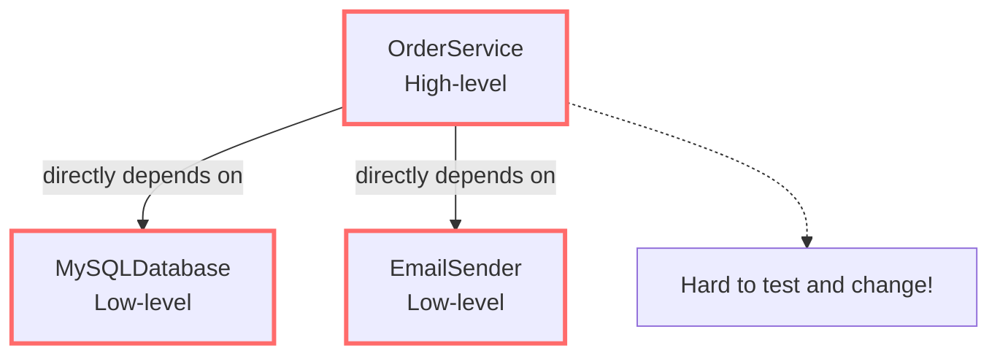
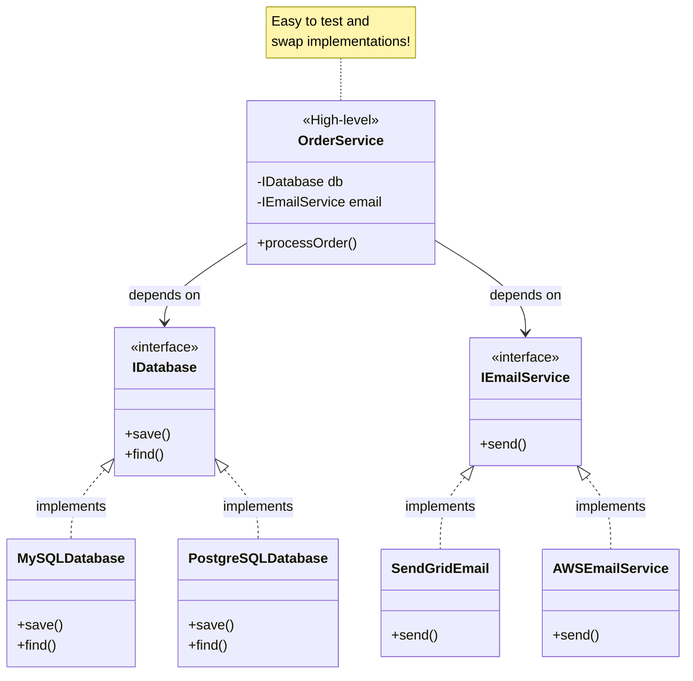

# Dependency Inversion Principle (DIP)

> Depend on abstractions, not concretions.

## Bad - High-level depends on Low-level

## Good - Both depend on Abstractions

## Key Takeaway

High-level modules should not depend on low-level modules. Both should depend on **abstractions** (interfaces). This makes the code flexible, testable, and easy to change.
