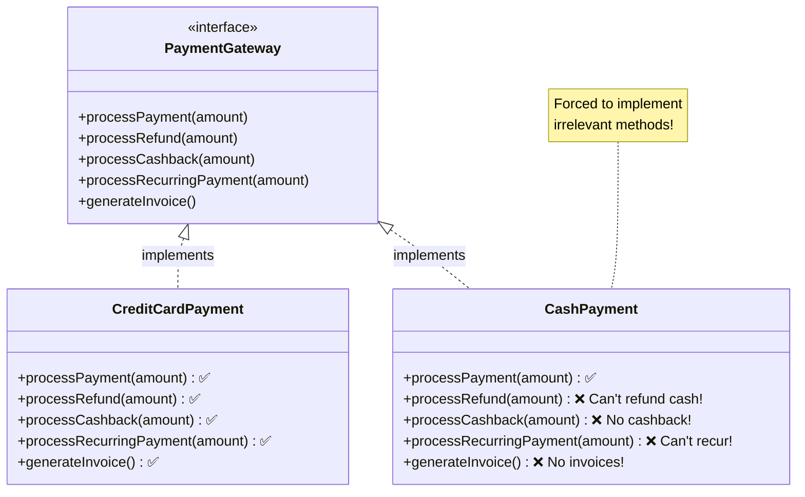
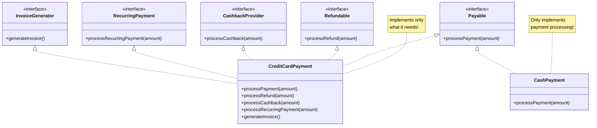

# Interface Segregation Principle (ISP)

> Many specific interfaces are better than one general interface.

## Bad - Fat Interface

## Good - Segregated Interfaces

## Key Takeaway

Clients should not be forced to depend on interfaces they don't use. Create **small, specific interfaces** rather than one large, general-purpose interface.
