# Liskov Substitution Principle (LSP)

> Subtypes must be substitutable for their base types.

## Three Rules to Follow

| Rule                               | Parent Expects                             | Child Breaks                                   | Child Respects                                     |
| ---------------------------------- | ------------------------------------------ | ---------------------------------------------- | -------------------------------------------------- |
| **1. Preconditions (Input)**       | Accepts any amount `process(100)` works    | Rejects negative amounts `process(-50)` fails  | Accepts any amount `process(-50)` works            |
| **2. Postconditions (Output)**     | Always completes processing Returns `void` | Throws exception on refunds `refund()` crashes | Always completes processing Returns `void`         |
| **3. Invariants (Internal State)** | Keeps transaction history private          | Exposes internal state publicly Breaks privacy | Maintains transaction history as private/protected |

**💡 Think of it as a contract:** If `PaymentProcessor` promises to accept any amount and process it, child classes like `CreditCardPayment` must honor that same promise—without adding restrictions, throwing unexpected errors, or exposing internal data.

## Bad - Violates LSP

```mermaid
classDiagram
    class PaymentProcessor {
        <<abstract>>
        +process(amount) void
        +refund(amount) void
        +getTransactionFee() double
    }

    class CreditCardPayment {
        +process(amount) void ✅
        +refund(amount) void ✅
        +getTransactionFee() double ✅
    }

    class CashPayment {
        +process(amount) void ✅
        +refund(amount) void ❌ throws exception!
        +getTransactionFee() double ❌ returns 0 always
    }

    PaymentProcessor <|-- CreditCardPayment
    PaymentProcessor <|-- CashPayment

    note for CashPayment "Breaks LSP! <br/> Can't refund cash payments <br/> or calculate fees properly"
```

## Good - Respects LSP

## Key Takeaway

Child classes must be **substitutable** for their parent classes without breaking the application. Don't strengthen preconditions, weaken postconditions, or violate invariants.
