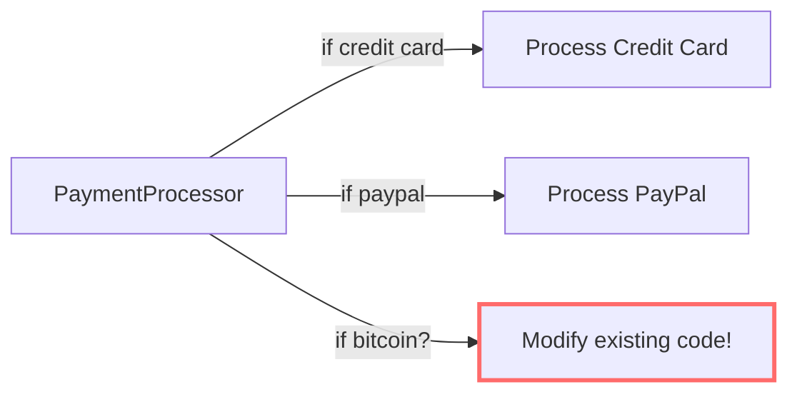
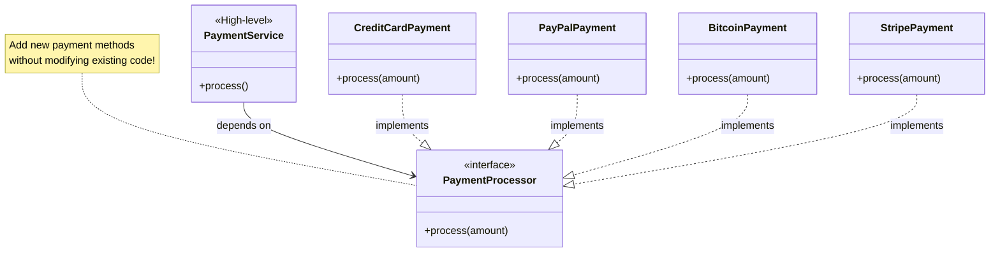

# Open/Closed Principle (OCP)

> Open for extension, closed for modification.

## Bad - Modifying Existing Code

## Good - Extending with New Classes

## Key Takeaway

Software entities should be **open for extension** (add new functionality) but **closed for modification** (don't change existing code). Use interfaces and abstractions to allow new behaviors without altering existing implementations.
