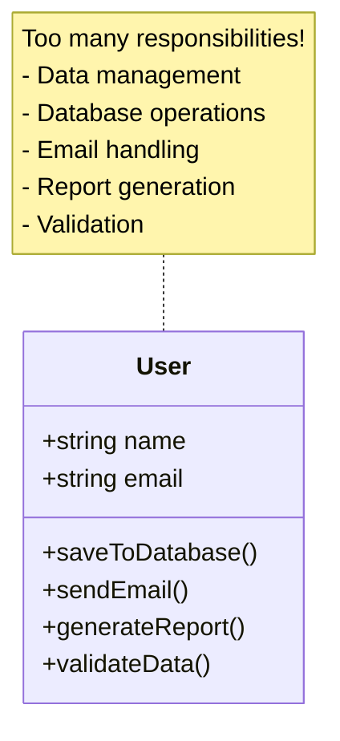
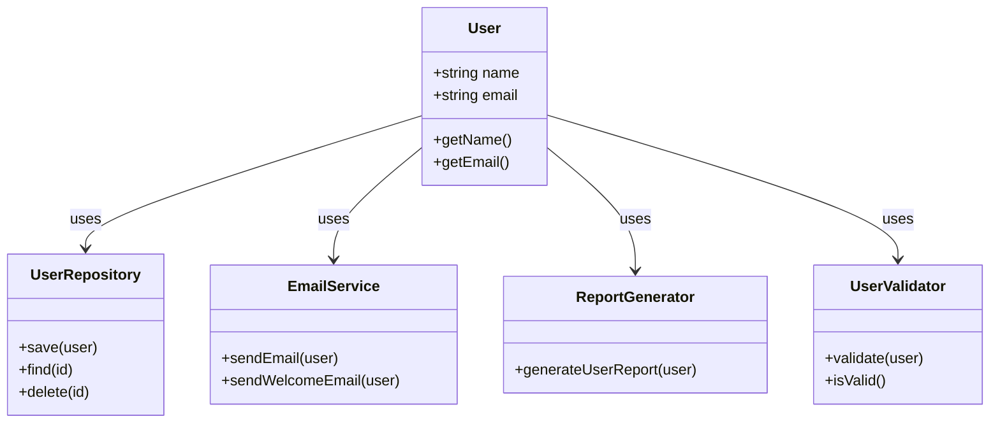

# Single Responsibility Principle (SRP)

> A class should have only one reason to change.

## Bad - Multiple Responsibilities

## Good - Single Responsibility

## Key Takeaway

Each class should have **only one reason to change**. Separate concerns into different classes to improve maintainability and testability.
